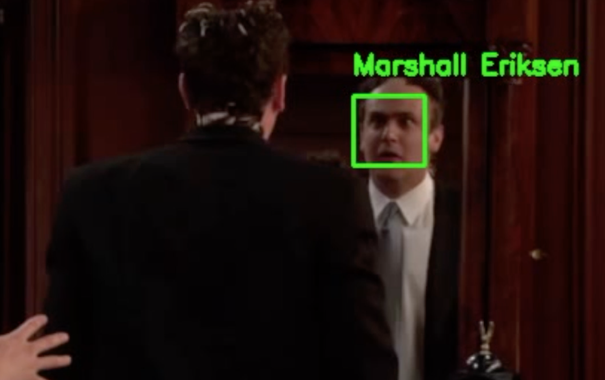
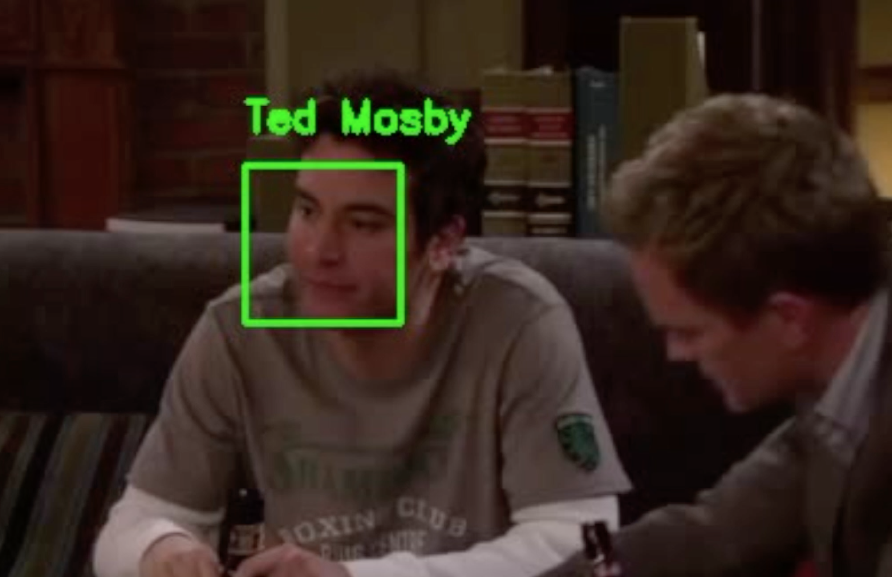
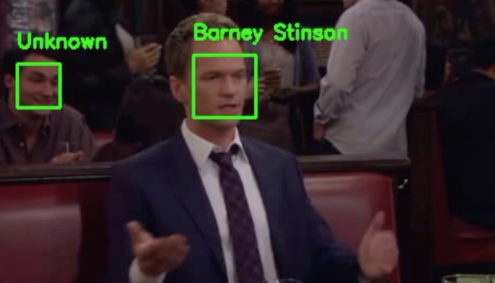
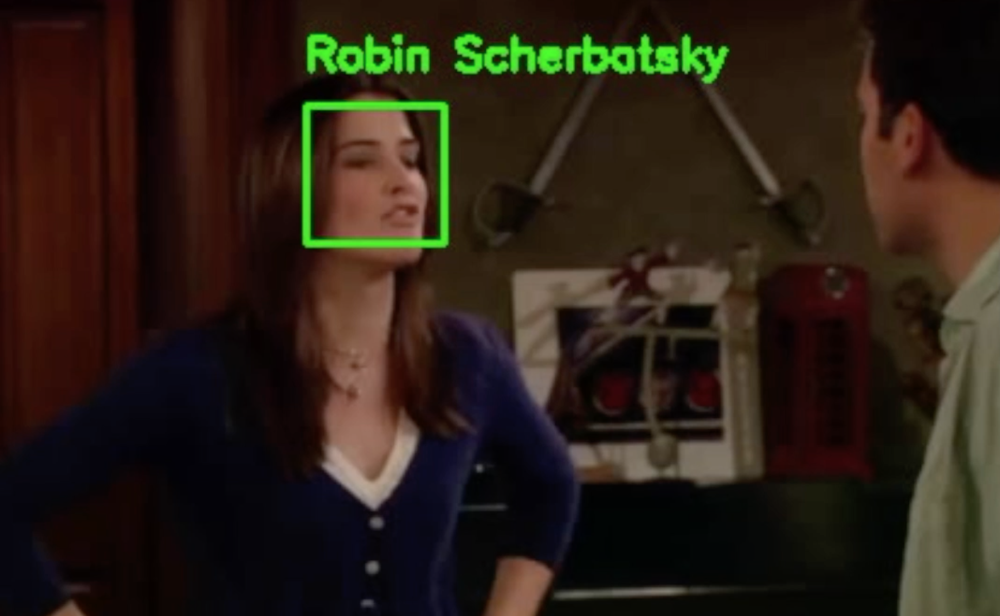

# Movies-FaceID
This project is an implementation of facial recognition for faces in movies.

## How it works
The way it works is the following:  
1- Detect faces with Haar Cascade, Hog or CNN based algorithms
2- Extract 128 facial landmark features (using models such as OpenFace)
3- Train a K-Nearest-Neighbor model (SVM or a neural network would work as well) to predict the person based on the 128 facial features.

## How to generate a video with FaceID
Generate a video based on any input video in quite easy. The most demanding tasks will be the gather the data, the rest of it is just some commands to run through your terminal.

### Setup the environment
First of all you should install the necessary Python packages. You may want to create a virtual environment dedicated for your project, if you use conda, you can do the following:
```bash
conda create -n yourenvname python=x.x anaconda
```
And then you activate your newly created environment
```bash
source activate yourenvname
```
Creating a virtual environment is optional but makes things cleaner.  
Then you can install all the package at once by running the following command:
```bash
pip install -r requirements.txt
```
Note that some packages might not be necessary, feel free to install package individually if you wish to.

### Gather the data
You should gather at least 50 different pictures for each of the character you want the model to learn about. Of course the more you have, the better it would be, however you should be careful to have a balanced dataset (all the characters should have more or less the same number of picture).
**Important** The images should be organised in folders, one folder per character.

### Generate facial features for each picture in the dataset
Run the following command
```bash
python make_features.py --dataset data --encodings HIMYMEmbedding.pickle 
```
--dataset : path to input directory of faces + images 
--encodings = path to serialized db of facial encodings

The facial features are made of 128 dimensions which plotted in 2D gives the following:


### Train the model
Run the following command
```bash
python train_faces.py --data_link HIMYMEmbedding.pickle --output_link model.pickle
```
--dataset : path to input directory of faces + images"
--output_link : path to output model
The model used in a K-Nearest-Neigbor model (KNN) which I believe is enough for such a task, but feel free to use other more advanced models such as SVM or Deep Neural Networks.
In order to classify a face as "unknown" I have use the L2 distance with a certain threshold. You might have to adjust it if you feel that too much faces have been classified as "unknown" while they shouldn't have.

### Generate the video
```bash
python make_output_video.py --input_link videos/HIMYM.mp4 --output_link output/test.avi --model_link model.pickle
```
--input_link : path to input video file
--output_link : path to output video file
--model_link", path to the model

## Screenshot and Video
Here are some screenshots and a YouTube video you can check out to see the model in **action**

<p float="left">
  
   
  
</p>

<p float="left">
  
   
  
</p>

**YouTube Video**
https://www.youtube.com/watch?v=FFSCjMLhvjk&t=4s
